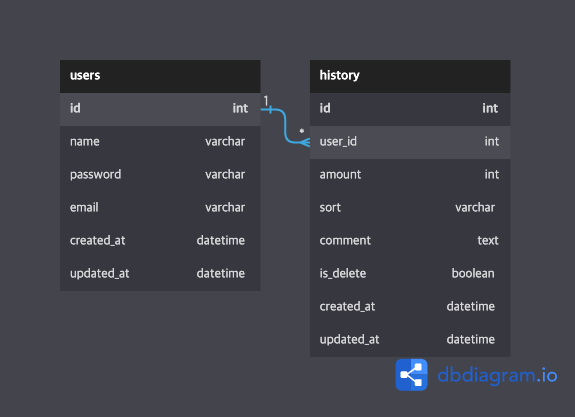

# Account Book

가계부 어플리케이션 API

## Installation

requirements.txt 파일을 이용하여 필요한 패키지를 설치합니다.

```bash
pip install -r requirements.txt
```

## Database



## Feature

* 회원가입 및 로그인/로그아웃

    + 회원가입을 한 사용자는 로그인과 로그아웃이 가능합니다.
    + 로그인/로그아웃 과정에서 토큰 기반 인증을 적용하였습니다.

* 가계부 CRUD

    + 수입/지출금액 및 메모를 가계부에 등록할 수 있습니다.(Create)
    + 본인이 등록한 가계부에대해 목록 및 상세조회가 가능합니다.(Read)
    + 본인이 등록한 가계부를 수정 또는 삭제할 수 있습니다.(Update, Delete)

## API

모든 요청의 데이터는 JSON으로 전달합니다.

* 회원가입

    + Request: `(POST) /api/signup/`
    + Body
        ```
        {   
            "name": "이름",
            "email": "email@email.com",
            "password": "password"
        }
        ```
    + Response
        ```
        {   
            "msg": "user_created",
            "status": 201
        }
        ```
* 로그인

    + Request: `(GET) /api/signin/`
    + Body
        ```
        {
            "name": "이름",
            "email": "email@email.com",
            "password": "password"
        }
        ```
    + Response
        ```
        { 
            "auth_token": "user_created",
            "status": 200
        }
        ```
* 내역 조회(목록)

    + Request: `(GET) /api/history`
    + Header
        ```
        {
            "Authorization": "token"
        }
        ```
    + Response
        ```
        {
            "res": [
                {
                    "id": 41,
                    "created_at": "2022-11-07T00:06:56.102506",
                    "updated_at": "2022-11-07T00:06:56.102572",
                    "amount": 6000,
                    "sort": "E",
                    "comment": "점심 식사",
                    "is_delete": false,
                    "user": 50
                },
                {
                    "id": 42,
                    "created_at": "2022-11-07T00:07:11.151510",
                    "updated_at": "2022-11-07T00:07:11.151580",
                    "amount": 3000,
                    "sort": "E",
                    "comment": "디저트",
                    "is_delete": false,
                    "user": 50
                }
            ],
            "status": 200
        }
        ```
* 내역 조회(상세)

    + Request: `(GET) /api/history/41`
    + Header
        ```
        {
            "Authorization": "token"
        }
        ```
    + Response
        ```
        {
            "res": {
                "id": 41,
                "created_at": "2022-11-07T00:06:56.102506",
                "updated_at": "2022-11-07T00:06:56.102572",
                "amount": 6000,
                "sort": "E",
                "comment": "점심 식사",
                "is_delete": false,
                "user": 50
            },
            "status": 200
        }
        ```
* 내역 수정

    + Request: `(PUT) /api/history/41/update/`
    + Header
        ```
        {
            "Authorization": "token"
        }
        ```
    + Body
        ```
        {
            "amount": 11000,
            "sort": "E",
            "comment": "점심 식사(수정)"
        }
        ```
    + Response
        ```
        {
            "res": {
                "id": 41,
                "created_at": "2022-11-07T00:06:56.102506",
                "updated_at": "2022-11-07T00:06:56.102572",
                "amount": 11000,
                "sort": "E",
                "comment": "점심 식사(수정)",
                "is_delete": false,
                "user": 50
            },
            "status": 200
        }
        ```

* 내역 삭제

    + Request: `(DELETE) /api/history/41/delete/`
    + Header
        ```
        {
            "Authorization": "token"
        }
        ```
    + Response
        ```
        {
            "res": {
                "id": 41,
                "created_at": "2022-11-07T00:06:56.102506",
                "updated_at": "2022-11-07T00:06:56.102572",
                "amount": 11000,
                "sort": "E",
                "comment": "점심 식사(수정)",
                "is_delete": true,
                "user": 50
            },
            "status": 200
        }
        ```